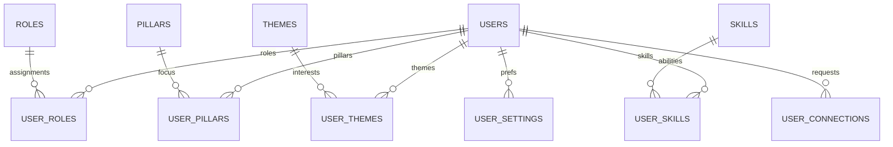
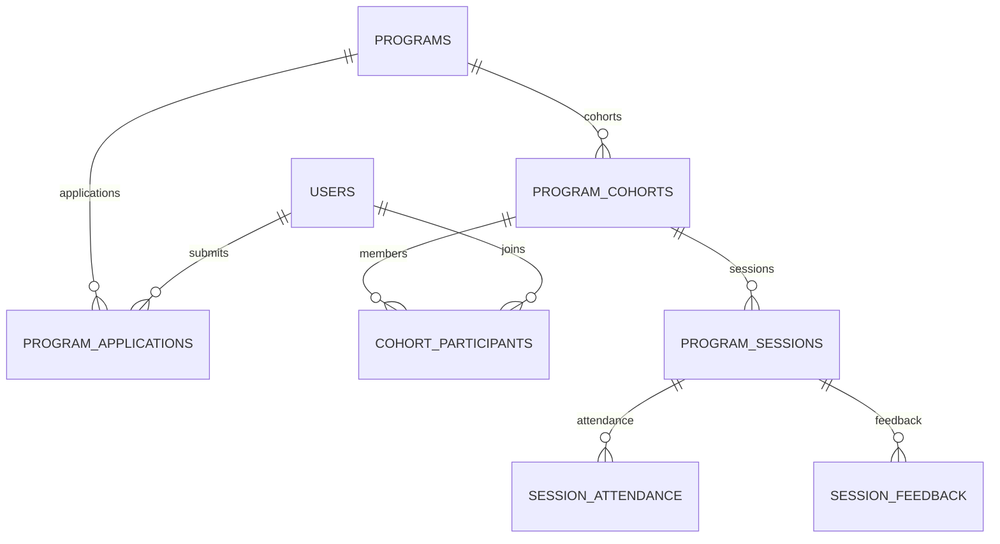
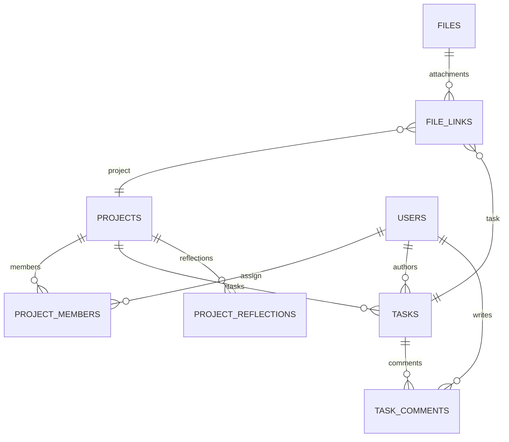
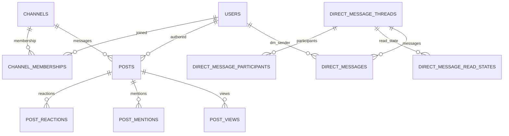

Below is a relational database plan for the Glenride platform, designed to support:

- Users & roles  
- Programs & applications  
- Library content  
- Community (posts, comments, messages, events)  
- Projects & tasks  
- Files / documents  
- Notifications & basic analytics

I’ll present this as a conceptual schema with table names, key fields, and relationships. You can adapt to PostgreSQL, MySQL, or a hybrid (SQL + document store) later.

---

## 0. Interactive Feature Map

| Feature Cluster | Primary Interactions | Tables / Views |
| --- | --- | --- |
| Profiles & Identity | Account creation, authentication, invitations, role assignment | `users`, `user_roles`, `user_connections`, `user_settings` |
| Pillars, Themes & Skills | Tagging expertise, discovery filters, matchmaking | `pillars`, `themes`, `skills`, `user_pillars`, `user_themes`, `user_skills` |
| Program Journeys | Publish programs, manage cohorts, attendance, collect feedback | `programs`, `program_cohorts`, `cohort_participants`, `program_sessions`, `session_attendance`, `session_feedback` |
| Applications & Reviews | Application intake, reviewer workflows, decision tracking | `program_applications`, `join_requests`, `contact_messages` |
| Project Collaboration | Workspaces, membership, tasks, reflections, attachments | `projects`, `project_members`, `tasks`, `task_comments`, `project_reflections`, `file_links` |
| Community Channels | Channel membership, async discussions, reactions, mentions | `channels`, `channel_memberships`, `posts`, `post_reactions`, `post_mentions`, `post_views` |
| Direct Messaging | DM threads, participants, read receipts, mute controls | `direct_message_threads`, `direct_message_participants`, `direct_message_read_states`, `direct_messages` |
| Events & RSVP | Event publishing, registrations, reminders, discussions | `events`, `event_registrations`, `posts` (with `context_type = event`), `notifications` |
| Library & Knowledge | Resource publishing, tagging, readership analytics | `library_items`, `library_item_pillars`, `library_item_themes`, `library_item_views`, `file_links` |
| Notifications & Activity | Feed alerts, digests, audit trails | `notifications`, `user_settings`, `activity_log` |
| Personalization & Saved Items | Watchlists, bookmarks, gradual feature rollouts | `saved_items`, `feature_flags`, `user_settings` |

---

## 1. Core & Identity

### 1.1 `users`
Represents every person with an account.

- `id` (PK, UUID)
- `email` (unique, indexed)
- `password_hash` (nullable if SSO)
- `first_name`
- `last_name`
- `display_name`
- `pronouns` (nullable)
- `location` (text, nullable)
- `bio` (text, nullable)
- `profile_image_url` (nullable)
- `website_url` (nullable)
- `created_at`
- `updated_at`
- `last_login_at`
- `status` (enum: `active`, `invited`, `deactivated`, `banned`)

**Relationships:**
- 1–many with `user_roles`, `program_applications`, `project_members`, `posts`, etc.

---

### 1.2 `roles`
Roles within the Glenride platform.

- `id` (PK)
- `name` (e.g., `member`, `scholar`, `builder`, `organizer`, `partner`, `admin`)
- `description`

### 1.3 `user_roles`
Many-to-many between users and roles.

- `user_id` (FK → `users.id`)
- `role_id` (FK → `roles.id`)
- `created_at`

**Composite PK:** (`user_id`, `role_id`)

---

### 1.4 `user_connections`
Optional follow/connection graph that powers introductions, invitations, and curated feeds.

- `id` (PK)
- `requester_id` (FK → `users.id`)
- `addressee_id` (FK → `users.id`)
- `status` (enum: `pending`, `accepted`, `rejected`, `blocked`)
- `connected_at` (nullable) – populated when status becomes `accepted`
- `message` (nullable) – optional invite note
- `created_at`
- `updated_at`

Unique index: (`requester_id`, `addressee_id`). Add check constraint preventing self-connections.

---

## 2. Pillars, Themes, Skills

### 2.1 `pillars`
Glenride’s three main pillars.

- `id` (PK)
- `name` (enum-ish: `ethics`, `critique`, `praxis`)
- `description`

> In code you might enforce the three via an enum and keep this table just for referential consistency and tagging.

---

### 2.2 `themes`
Topical focus areas (climate, migration, AI, etc.).

- `id` (PK)
- `name` (e.g., “Climate & Extractive Economies”)
- `slug`
- `description`

---

### 2.3 `skills`
Skills users can list.

- `id` (PK)
- `name` (e.g., “research”, “policy drafting”, “Python”, “community organizing”)
- `category` (optional: `technical`, `organizing`, `research`, etc.)

---

### 2.4 `user_pillars`
Which pillars a user focuses on (for matching / recommendations).

- `user_id` (FK → `users.id`)
- `pillar_id` (FK → `pillars.id`)
- `created_at`

Composite PK: (`user_id`, `pillar_id`)

---

### 2.5 `user_themes`
User’s thematic interests.

- `user_id` (FK → `users.id`)
- `theme_id` (FK → `themes.id`)
- `created_at`

Composite PK: (`user_id`, `theme_id`)

---

### 2.6 `user_skills`
User’s skills.

- `user_id` (FK → `users.id`)
- `skill_id` (FK → `skills.id`)
- `proficiency` (enum: `beginner`, `intermediate`, `advanced`, `expert`)
- `created_at`

Composite PK: (`user_id`, `skill_id`)

---

## 3. Programs & Cohorts

### 3.1 `programs`
E.g. Ethics Labs, Justice by Design Fellowship.

- `id` (PK)
- `title`
- `slug`
- `short_description`
- `long_description`
- `program_type` (enum: `fellowship`, `lab`, `school`, `incubator`, `studio`, `other`)
- `application_open_at` (nullable)
- `application_close_at` (nullable)
- `default_duration_weeks` (nullable)
- `is_public` (bool)
- `status` (enum: `draft`, `upcoming`, `active`, `completed`, `archived`)
- `created_by` (FK → `users.id`)
- `created_at`
- `updated_at`

---

### 3.2 `program_pillars`
Mapping programs to one or more pillars.

- `program_id` (FK → `programs.id`)
- `pillar_id` (FK → `pillars.id`)

Composite PK: (`program_id`, `pillar_id`)

---

### 3.3 `program_themes`
Mapping programs to themes.

- `program_id`
- `theme_id`

Composite PK: (`program_id`, `theme_id`)

---

### 3.4 `program_cohorts`
Concrete intakes / cycles of a program.

- `id` (PK)
- `program_id` (FK → `programs.id`)
- `name` (e.g., “Cohort 01 – 2025”)
- `start_date`
- `end_date`
- `max_participants` (nullable)
- `status` (enum: `upcoming`, `active`, `completed`, `archived`)
- `meeting_cadence` (text, optional)
- `created_at`
- `updated_at`

---

### 3.5 `program_applications`
User applications to join a program or cohort.

- `id` (PK)
- `user_id` (FK → `users.id`)
- `program_id` (FK → `programs.id`)
- `program_cohort_id` (FK → `program_cohorts.id`, nullable if cohort assigned later)
- `role_self_identified` (text: scholar/builder/organizer/partner/other)
- `location` (text snapshot)
- `background` (long text)
- `motivation` (long text)
- `how_they_want_to_collaborate` (long text)
- `status` (enum: `submitted`, `under_review`, `accepted`, `rejected`, `withdrawn`)
- `review_notes` (text, nullable)
- `reviewed_by` (FK → `users.id`, nullable)
- `created_at`
- `updated_at`

Index: `user_id`, `program_id`

---

### 3.6 `cohort_participants`
Who is in which cohort.

- `id` (PK)
- `program_cohort_id` (FK → `program_cohorts.id`)
- `user_id` (FK → `users.id`)
- `role` (enum: `participant`, `facilitator`, `mentor`, `admin`)
- `joined_at`
- `status` (enum: `active`, `completed`, `dropped`)

Index: (`program_cohort_id`, `user_id`) unique.

---

### 3.7 `program_sessions`
Specific meetings / workshops in a cohort.

- `id` (PK)
- `program_cohort_id` (FK → `program_cohorts.id`)
- `title`
- `description` (nullable)
- `starts_at`
- `ends_at`
- `location_type` (enum: `online`, `in_person`, `hybrid`)
- `location_details` (Zoom link, address, etc.)
- `created_at`
- `updated_at`

---

### 3.8 `session_attendance`
Attendance tracking.

- `id` (PK)
- `program_session_id` (FK → `program_sessions.id`)
- `user_id` (FK → `users.id`)
- `status` (enum: `attended`, `absent`, `excused`)
- `checked_in_at` (nullable)

---

### 3.9 `session_feedback`
Structured or free-form responses collected after live sessions to power retros, participant dashboards, and facilitator follow-ups.

- `id` (PK)
- `program_session_id` (FK → `program_sessions.id`)
- `user_id` (FK → `users.id`)
- `rating` (nullable small int, e.g., 1–5)
- `mood` (enum: `energized`, `neutral`, `stretched`, `concerned`, etc.)
- `feedback_text` (long text / JSON for form answers)
- `submitted_at`

Indexes: (`program_session_id`, `user_id`) unique to prevent duplicates; `rating` for aggregation queries.

---

## 4. Projects (Praxis Workspaces)

### 4.1 `projects`
Concrete initiatives.

- `id` (PK)
- `title`
- `slug`
- `summary`
- `description` (long text)
- `status` (enum: `idea`, `design`, `in_progress`, `paused`, `completed`, `archived`)
- `created_by` (FK → `users.id`)
- `program_id` (nullable FK → `programs.id`) – if birthed inside a specific program
- `created_at`
- `updated_at`

---

### 4.2 `project_pillars`

- `project_id` (FK → `projects.id`)
- `pillar_id` (FK → `pillars.id`)

Composite PK: (`project_id`, `pillar_id`)

---

### 4.3 `project_themes`

- `project_id`
- `theme_id`

Composite PK: (`project_id`, `theme_id`)

---

### 4.4 `project_members`
Who is on which project.

- `id` (PK)
- `project_id` (FK → `projects.id`)
- `user_id` (FK → `users.id`)
- `role` (enum: `lead`, `researcher`, `technologist`, `organizer`, `advisor`, `observer`, `other`)
- `joined_at`
- `is_active` (bool)

Unique index: (`project_id`, `user_id`)

---

### 4.5 `tasks`
Tasks within projects.

- `id` (PK)
- `project_id` (FK → `projects.id`)
- `title`
- `description` (text, nullable)
- `status` (enum: `todo`, `in_progress`, `review`, `done`, `archived`)
- `priority` (enum: `low`, `medium`, `high`, `urgent`)
- `created_by` (FK → `users.id`)
- `assigned_to` (FK → `users.id`, nullable)
- `due_date` (nullable)
- `created_at`
- `updated_at`

Index: `project_id`, `status`, `assigned_to`

---

### 4.6 `task_comments`

- `id` (PK)
- `task_id` (FK → `tasks.id`)
- `author_id` (FK → `users.id`)
- `body` (text)
- `created_at`
- `updated_at`

---

### 4.7 `project_reflections`
For “Impact & Reflection” tab.

- `id` (PK)
- `project_id` (FK → `projects.id`)
- `author_id` (FK → `users.id`)
- `title`
- `body` (long text)
- `created_at`
- `updated_at`
- `visibility` (enum: `project_only`, `program_members`, `public`)

---

## 5. Community: Posts, Threads, Messages, Events

### 5.1 `channels`
Discussion spaces like #announcements, #ethics-labs.

- `id` (PK)
- `name` (e.g., `announcements`, `introductions`)
- `display_name` (e.g., “Announcements”)
- `description` (text)
- `visibility` (enum: `public`, `members`, `program_only`)  
- `program_id` (FK, nullable) – e.g., channel specific to a program/cohort
- `is_read_only` (bool; e.g., for announcements)
- `created_at`
- `created_by` (FK → `users.id`)

---

### 5.2 `channel_memberships`
Tracks which users can view/post inside a channel while capturing notification preferences.

- `id` (PK)
- `channel_id` (FK → `channels.id`)
- `user_id` (FK → `users.id`)
- `role` (enum: `owner`, `moderator`, `member`, `guest`)
- `notification_level` (enum: `muted`, `default`, `high`)
- `last_read_post_id` (nullable FK → `posts.id`)
- `last_read_at` (nullable)
- `joined_at`
- `muted_until` (nullable timestamp)

Unique index: (`channel_id`, `user_id`). Secondary index on `last_read_post_id` to fetch unread counts efficiently.

---

### 5.3 `posts`
Messages inside channels (or project discussions, if reused polymorphically).

- `id` (PK)
- `channel_id` (FK → `channels.id`, nullable if using generic threads)
- `author_id` (FK → `users.id`)
- `body` (text)
- `parent_post_id` (FK → `posts.id`, nullable) – for threaded replies
- `context_type` (enum: `channel`, `project`, `program`, `direct_message_thread`)
- `context_id` (UUID, nullable) – e.g., `project_id`, `program_cohort_id`
- `created_at`
- `updated_at`
- `is_edited` (bool)
- `is_deleted` (bool)

Indexes: `channel_id`, `context_type/context_id`, `parent_post_id`.

---

### 5.4 `post_reactions`
Optional simple reactions (“like”, etc.).

- `id` (PK)
- `post_id` (FK → `posts.id`)
- `user_id` (FK → `users.id`)
- `reaction_type` (enum: `like`, `insightful`, etc.)
- `created_at`

Unique index: (`post_id`, `user_id`, `reaction_type`)

---

### 5.5 `post_mentions`
Keeps track of @mentions to drive targeted notifications and mention lists.

- `id` (PK)
- `post_id` (FK → `posts.id`)
- `mentioned_user_id` (FK → `users.id`)
- `created_at`

Unique index: (`post_id`, `mentioned_user_id`) to avoid duplicate mentions; optional partial index on `mentioned_user_id` for inbox queries.

---

### 5.6 `post_views`
Per-user read receipts for posts (and threaded replies) to power “unread” badges and analytics.

- `id` (PK)
- `post_id` (FK → `posts.id`)
- `user_id` (FK → `users.id`)
- `viewed_at`

Unique index: (`post_id`, `user_id`). Secondary index on `user_id` for “recently viewed” listings.

---

### 5.7 `direct_message_threads`

- `id` (PK)
- `created_at`

### 5.8 `direct_message_participants`

- `thread_id` (FK → `direct_message_threads.id`)
- `user_id` (FK → `users.id`)
- `joined_at`

Composite PK: (`thread_id`, `user_id`)

---

### 5.9 `direct_message_read_states`
Stores the last message seen per participant so we can highlight unread DMs and manage mute/notification preferences.

- `id` (PK)
- `thread_id` (FK → `direct_message_threads.id`)
- `user_id` (FK → `users.id`)
- `last_read_message_id` (FK → `direct_messages.id`, nullable)
- `last_read_at` (nullable)
- `notifications_muted` (bool, default false)
- `muted_until` (nullable timestamp)

Unique index: (`thread_id`, `user_id`).

---

### 5.10 `direct_messages`

- `id` (PK)
- `thread_id` (FK → `direct_message_threads.id`)
- `sender_id` (FK → `users.id`)
- `body` (text)
- `created_at`
- `is_deleted` (bool)

(Alternatively, you can reuse `posts` with `context_type = 'direct_message_thread'`.)

---

### 5.11 `events`
Community or program events.

- `id` (PK)
- `title`
- `description`
- `starts_at`
- `ends_at`
- `location_type` (enum: `online`, `in_person`, `hybrid`)
- `location_details` (Zoom link, address, etc.)
- `visibility` (enum: `public`, `members`, `program_only`, `cohort_only`)
- `program_id` (nullable FK → `programs.id`)
- `program_cohort_id` (nullable FK → `program_cohorts.id`)
- `created_by` (FK → `users.id`)
- `created_at`
- `updated_at`

---

### 5.12 `event_registrations`

- `id` (PK)
- `event_id` (FK → `events.id`)
- `user_id` (FK → `users.id`)
- `status` (enum: `registered`, `waitlisted`, `cancelled`, `attended`)
- `registered_at`
- `checked_in_at` (nullable)

Unique index: (`event_id`, `user_id`)

---

## 6. Library & Documents

### 6.1 `library_items`
Articles, videos, audio, resources.

- `id` (PK)
- `title`
- `slug`
- `description` (short)
- `content_type` (enum: `article`, `video`, `audio`, `briefing`, `guide`, `recording`, `other`)
- `access_level` (enum: `public`, `members`, `program_members`, `cohort_members`)
- `program_id` (nullable)
- `program_cohort_id` (nullable)
- `pillar_id` (nullable; or move to junction table if multi-pillar)
- `author_id` (FK → `users.id`, nullable)
- `external_url` (nullable) – for hosted video/audio
- `rich_content` (JSON/long text for article body, or pointer to CMS)
- `published_at` (nullable)
- `created_at`
- `updated_at`
- `status` (enum: `draft`, `published`, `archived`)

---

### 6.2 `library_item_pillars`
If you need multi-pillar tagging.

- `library_item_id`
- `pillar_id`

Composite PK: (`library_item_id`, `pillar_id`)

---

### 6.3 `library_item_themes`
Tag library content by theme.

- `library_item_id`
- `theme_id`

Composite PK: (`library_item_id`, `theme_id`)

---

### 6.4 `library_item_views`
Basic analytics.

- `id` (PK)
- `library_item_id` (FK → `library_items.id`)
- `user_id` (FK → `users.id`, nullable for anonymous)
- `viewed_at`

---

### 6.5 `files`
General file metadata (for documents, recordings, attachments).

- `id` (PK)
- `uploader_id` (FK → `users.id`)
- `storage_provider` (enum: `s3`, `gcs`, etc.)
- `storage_key` (path in bucket)
- `original_filename`
- `mime_type`
- `size_bytes`
- `created_at`

---

### 6.6 `file_links`
Polymorphic attachment table so any entity can have files.

- `id` (PK)
- `file_id` (FK → `files.id`)
- `linked_type` (enum: `project`, `task`, `program`, `program_session`, `library_item`, `post`, `event`)
- `linked_id` (UUID or big int, depending on PK type)
- `created_at`

---

## 7. Notifications & Activity

### 7.1 `notifications`
User-specific in-app + optional email notifications.

- `id` (PK)
- `user_id` (FK → `users.id`) – recipient
- `type` (enum: `program_application_status_changed`, `new_message`, `event_reminder`, `task_assigned`, `project_invite`, etc.)
- `data` (JSONB) – additional payload (e.g., `{"program_id": "...", "status": "accepted"}`)
- `is_read` (bool, default false)
- `created_at`
- `read_at` (nullable)

Indexes: `user_id`, `is_read`

---

### 7.2 `activity_log`
System-level audit / analytics.

- `id` (PK)
- `actor_id` (FK → `users.id`, nullable for system)
- `action` (string/enum: `created_project`, `updated_task`, `joined_program`, etc.)
- `entity_type` (e.g., `project`, `task`, `program`, `post`)
- `entity_id`
- `metadata` (JSONB)
- `created_at`

Can feed dashboards, “Recent activity” streams, etc.

---

## 8. Access Control & Settings

For early versions, role-based access checks can be handled in application logic, but you can still prepare tables to support finer-grain control later.

### 8.1 `feature_flags` (optional)

- `id` (PK)
- `key` (string)
- `description`
- `is_enabled` (bool)
- `created_at`

### 8.2 `user_settings`

- `id` (PK)
- `user_id` (FK → `users.id`)
- `setting_key` (e.g., `email_notifications`, `timezone`)
- `setting_value` (string/JSON)
- `updated_at`

### 8.3 `permissions`
Defines canonical actions the system cares about (RBAC capability matrix).

- `id` (PK, UUID)
- `name` (unique, e.g., `view_program`, `edit_program`, `admin_all`)
- `description` (text)
- `created_at`
- `updated_at`

Example permission names:
- `view_program`, `edit_program`, `manage_program_cohort`
- `view_library_item`, `create_library_item`, `edit_library_item`, `publish_library_item`
- `view_community_channel`, `post_community_message`, `moderate_community`
- `view_all_projects`, `create_project`, `edit_own_project`, `edit_any_project`
- `view_event`, `create_event`, `manage_events`
- `view_users`, `manage_users`, `manage_roles`
- `admin_all` (super-admin catch-all)

### 8.4 `role_permissions`
Maps roles to permissions (many-to-many).

- `role_id` (FK → `roles.id`)
- `permission_id` (FK → `permissions.id`)
- `created_at`

**Composite PK:** (`role_id`, `permission_id`)

### 8.5 `resource_permissions`
Optional fine-grained ACL overrides per resource (for special cases like "this partner can view this specific project").

- `id` (PK, UUID)
- `resource_type` (e.g., `project`, `program`, `channel`, `library_item`, `event`)
- `resource_id` (UUID)
- `grantee_type` (enum: `user`, `role`)
- `grantee_id` (UUID – references `users.id` or `roles.id`)
- `permission_id` (FK → `permissions.id`)
- `is_allowed` (bool, default true – set false for explicit denials)
- `created_at`
- `updated_at`

**Indexes:** (`resource_type`, `resource_id`), (`grantee_type`, `grantee_id`)

**Authorization Flow:**
1. Check global RBAC via `role_permissions`
2. Apply resource-level rules using `visibility`/`access_level` fields and membership tables
3. Consult `resource_permissions` for special overrides (allow or deny)

---

## 9. Join & Contact Forms (Public-to-Logged-in bridge)

If you want to store submissions from non-authenticated users:

### 9.1 `join_requests`

- `id` (PK)
- `name`
- `email`
- `self_description` (role they chose)
- `location`
- `current_work` (text)
- `collaboration_idea` (text)
- `status` (enum: `new`, `in_review`, `responded`, `converted_to_user`)
- `linked_user_id` (FK → `users.id`, nullable)
- `created_at`
- `updated_at`

---

### 9.2 `contact_messages`

- `id` (PK)
- `name`
- `email`
- `subject`
- `message`
- `status` (enum: `new`, `in_review`, `responded`, `archived`)
- `created_at`
- `updated_at`

---

## 10. Engagement & Personalization

### 10.1 `saved_items`
Cross-entity bookmarks/watchlists so members can return to posts, events, projects, or library items quickly.

- `id` (PK)
- `user_id` (FK → `users.id`)
- `saveable_type` (enum: `post`, `event`, `project`, `task`, `library_item`, `program`)
- `saveable_id` (UUID / big int matching entity PK)
- `notes` (nullable short text)
- `created_at`

Unique index: (`user_id`, `saveable_type`, `saveable_id`). Add supporting index on `saveable_type/saveable_id` to fetch who saved a thing (for analytics or shared resources).

---

## 11. How It All Connects (High-Level Relationship Map)

- **User**  
  - has many `user_roles`, `user_pillars`, `user_themes`, `user_skills`.  
  - applies to `programs` via `program_applications`.  
  - joins `program_cohorts` via `cohort_participants`.  
  - participates in `projects` via `project_members`.  
  - creates `posts`, `tasks`, `projects`, `library_items`, etc.  
  - receives `notifications`.  

- **Program**  
  - tagged with `pillars` and `themes`.  
  - has multiple `program_cohorts`.  
  - has many `program_applications`.  
  - may spawn `projects`.  
  - may own `channels`, `events`, `library_items`.

- **Cohort**  
  - has `cohort_participants`, `program_sessions`, `events`.

- **Project**  
  - tagged with `pillars` / `themes`.  
  - has `project_members`, `tasks`, `project_reflections`, `posts` (discussion), `files`.

- **Community**  
  - `channels` contain `posts` and `threads`.  
  - `events` link to programs/cohorts and have `event_registrations`.  

- **Library**  
  - `library_items` linked to pillars/themes/programs/cohorts.  
  - can have attached `files`.  
  - `library_item_views` capture engagement.

---

## 12. ERD-Style Relationship Notes

Use these module-focused diagrams (expressed textually) when building visual ERDs in tools like dbdiagram.io, DrawSQL, or Lucidchart.

### 12.1 Profiles & Identity
- `users` 1—* `user_roles`, `user_pillars`, `user_themes`, `user_skills`, `user_settings`.
- `users` 1—* `user_connections` (via requester/addressee dual FKs). Treat the table as self-referential.
- `roles` *—* `users` through `user_roles`.
- `skills`, `pillars`, `themes` each *—* `users` via junction tables; reuse same cardinality pattern for `programs/projects`.

### 12.2 Programs & Cohorts
- `programs` 1—* `program_cohorts`, `program_sessions`, `program_applications`.
- `program_cohorts` 1—* `cohort_participants`, `program_sessions`, `events` (when cohort specific).
- `program_sessions` 1—* `session_attendance`, `session_feedback`, `file_links` (polymorphic) .
- `cohort_participants` connects `users` *—* `program_cohorts` with role/status metadata.

### 12.3 Projects & Tasks
- `projects` 1—* `project_members`, `tasks`, `project_reflections`, `file_links`, `posts` (contextual threads).
- `project_members` links `users` *—* `projects` including roles and active state.
- `tasks` 1—* `task_comments`, `file_links`, `posts` (if using per-task discussions).
- `tasks`.`assigned_to` references `users` while `created_by` references the author; ensure FK constraints allow nullable `assigned_to`.

### 12.4 Community Channels & Messaging
- `channels` 1—* `channel_memberships`, `posts`.
- `channel_memberships` ties `users` *—* `channels` and stores read/unread metadata; cascades to `posts` via `last_read_post_id`.
- `posts` self-refer through `parent_post_id` for threads and connect to any entity via (`context_type`, `context_id`).
- `posts` 1—* `post_reactions`, `post_mentions`, `post_views`, `file_links`.
- `direct_message_threads` 1—* `direct_message_participants`, `direct_message_read_states`, `direct_messages`.

### 12.5 Events, Library, Notifications
- `events` 1—* `event_registrations`, `posts` (with `context_type = event`), `file_links`.
- `library_items` 1—* `library_item_views`, `file_links`; *—* `pillars/themes` via junction tables.
- `notifications` references whichever entity triggered the alert via JSON payload; `user_settings` controls delivery preferences.
- `saved_items` provides a polymorphic link from `users` to any `saveable_type`.

### 12.6 Files & Attachments
- `files` 1—* `file_links`.
- `file_links` polymorphically references `projects`, `tasks`, `posts`, `events`, `program_sessions`, `library_items`, etc. (FK enforcement via check constraints or app logic).

These textual pairings translate into crow’s-foot notation by treating each bullet as `Parent (1) —— (many) Child` unless specified as many-to-many via junction tables.

### 12.7 Mermaid Diagrams









---

## 13. Migration Implementation Roadmap

### 13.1 Phased Creation Order
1. **Foundations** – `users`, `roles`, `user_roles`, `pillars`, `themes`, `skills` (already present or earliest migrations).  
2. **Programs & Applications** – `programs`, `program_cohorts`, `program_applications`, `cohort_participants`, `program_sessions`, `session_attendance`, `session_feedback`.  
3. **Projects & Tasks** – `projects`, `project_members`, `tasks`, `task_comments`, `project_reflections`.  
4. **Community & Messaging** – `channels`, `channel_memberships`, `posts`, `post_reactions`, `post_mentions`, `post_views`, `direct_message_*` tables.  
5. **Events & Library** – `events`, `event_registrations`, `library_items`, tagging tables, `library_item_views`.  
6. **Files & Attachments** – `files`, `file_links`.  
7. **Engagement** – `notifications`, `activity_log`, `saved_items`, `feature_flags`, `user_settings`, `user_connections`.

Each phase keeps foreign keys pointing only to already-created tables, minimizing migration ordering issues.

### 13.2 Artisan Scaffolding
- Use Laravel generators to ensure timestamps/boilerplate follow conventions:  
  - `php artisan make:migration create_channel_memberships_table --create=channel_memberships`  
  - `php artisan make:migration add_session_feedback_table --create=session_feedback`  
  - Repeat for each new table; include `--table=` when altering existing ones. Always pass `--no-interaction` in CI scripts.
- For polymorphic tables (`file_links`, `saved_items`), include `morphs('saveable')` helpers or explicit `saveable_type` + `saveable_id` columns.

### 13.3 Indexing & Constraints Checklist
- Add composite unique indexes where noted (`channel_id + user_id`, `post_id + user_id`, etc.).  
- Use `foreignUuid` helpers for UUID PKs to stay consistent.  
- Include `check` constraints (supported in Postgres / MySQL 8) for enums like `status`, or mirror via Laravel `enum` columns.  
- Default booleans (`is_deleted`, `notifications_muted`) to `false`.  
- Soft deletes (`softDeletes()`) for user-generated content you expect to restore.

### 13.4 Data Migration & Backfill Steps
1. Deploy schema migrations phase-by-phase.  
2. Backfill reference data (`pillars`, `roles`, `skills` categories) using seeders (`php artisan make:seeder`).  
3. Write one-off Laravel commands (temporary) for migrating legacy content to new tables, then remove them per user guidelines.  
4. Enable feature flags to gate UI once the schema is live.

### 13.5 Testing & Verification
- Create Pest feature tests around CRUD operations for programs, projects, channels, and DMs to ensure FK integrity.  
- Use database factories for new tables (`php artisan make:factory ChannelFactory`) so seeding + tests stay simple.  
- Run targeted suites: `php artisan test --filter=ChannelTest` etc.  
- For large migrations, dry-run on staging (with `php artisan migrate --pretend`) to verify SQL output.

This roadmap keeps the rollout incremental, ensures referential integrity, and aligns with Glenride’s preference for iterating on existing patterns rather than introducing entirely new stacks.

---

## 14. Migration Scaffold Commands & Stubs

### 14.1 Recommended Artisan Commands

Run these (grouped by phase) with `--no-interaction` to generate boilerplate files:

```bash
# Community channels & messaging
php artisan make:migration create_channels_table --create=channels --no-interaction
php artisan make:migration create_channel_memberships_table --create=channel_memberships --no-interaction
php artisan make:migration create_posts_table --create=posts --no-interaction
php artisan make:migration create_post_reactions_table --create=post_reactions --no-interaction
php artisan make:migration create_post_mentions_table --create=post_mentions --no-interaction
php artisan make:migration create_post_views_table --create=post_views --no-interaction
php artisan make:migration create_direct_message_threads_table --create=direct_message_threads --no-interaction
php artisan make:migration create_direct_message_participants_table --create=direct_message_participants --no-interaction
php artisan make:migration create_direct_message_read_states_table --create=direct_message_read_states --no-interaction
php artisan make:migration create_direct_messages_table --create=direct_messages --no-interaction

# Engagement & personalization
php artisan make:migration create_user_connections_table --create=user_connections --no-interaction
php artisan make:migration create_saved_items_table --create=saved_items --no-interaction
php artisan make:migration create_session_feedback_table --create=session_feedback --no-interaction
```

### 14.2 Stub Templates

Use these snippets inside the generated `up()` methods (example shown for the most complex tables):

```php
Schema::create('channel_memberships', function (Blueprint $table) {
    $table->uuid('id')->primary();
    $table->foreignUuid('channel_id')->constrained()->cascadeOnDelete();
    $table->foreignUuid('user_id')->constrained()->cascadeOnDelete();
    $table->enum('role', ['owner', 'moderator', 'member', 'guest'])->default('member');
    $table->enum('notification_level', ['muted', 'default', 'high'])->default('default');
    $table->foreignUuid('last_read_post_id')->nullable()->constrained('posts')->nullOnDelete();
    $table->timestamp('last_read_at')->nullable();
    $table->timestamp('joined_at');
    $table->timestamp('muted_until')->nullable();
    $table->timestamps();

    $table->unique(['channel_id', 'user_id']);
});
```

```php
Schema::create('direct_message_read_states', function (Blueprint $table) {
    $table->uuid('id')->primary();
    $table->foreignUuid('thread_id')->constrained('direct_message_threads')->cascadeOnDelete();
    $table->foreignUuid('user_id')->constrained()->cascadeOnDelete();
    $table->foreignUuid('last_read_message_id')->nullable()->constrained('direct_messages')->nullOnDelete();
    $table->timestamp('last_read_at')->nullable();
    $table->boolean('notifications_muted')->default(false);
    $table->timestamp('muted_until')->nullable();
    $table->timestamps();

    $table->unique(['thread_id', 'user_id']);
});
```

```php
Schema::create('session_feedback', function (Blueprint $table) {
    $table->uuid('id')->primary();
    $table->foreignUuid('program_session_id')->constrained('program_sessions')->cascadeOnDelete();
    $table->foreignUuid('user_id')->constrained()->cascadeOnDelete();
    $table->unsignedTinyInteger('rating')->nullable();
    $table->enum('mood', ['energized', 'neutral', 'stretched', 'concerned'])->nullable();
    $table->json('feedback_text')->nullable();
    $table->timestamp('submitted_at');
    $table->timestamps();

    $table->unique(['program_session_id', 'user_id']);
});
```

Replicate the pattern for the remaining tables (UUID PKs, FK helpers, enums, unique indexes). Keeping stubs centralized prevents drift across engineers.

---

## 15. Community Channels Implementation Focus

### 15.1 Field-Level Guidance

| Table | Field | Notes |
| --- | --- | --- |
| `channels` | `visibility` | Enum values must match authorization logic (`public`, `members`, `program_only`). Default to `members`. |
| `channels` | `program_id` | Nullable FK; enforce `cascadeOnDelete` so archived programs remove dependent channels or add soft deletes. |
| `channel_memberships` | `last_read_post_id` | Nullable FK with `nullOnDelete` to avoid constraint failures when a post is removed. |
| `channel_memberships` | `muted_until` | Timestamp to enable temporary mutes. Ensure business logic un-mutes when time passes. |
| `posts` | `context_type/context_id` | Use Laravel polymorphic columns or manual enum+UUID pair. Index both columns for scoped queries. |
| `posts` | `parent_post_id` | Self-reference with `cascadeOnDelete` to ensure replies vanish when parent is deleted (or convert to soft deletes). |
| `post_mentions` | `mentioned_user_id` | Trigger notifications + mention list. Unique constraint prevents duplicates per post. |
| `post_views` | `viewed_at` | Use for unread logic; only insert when user loads thread to avoid noisy writes. |

### 15.2 Validation & Business Rules
1. **Channel creation** – restrict `name` to slug-safe strings; `display_name` required.  
2. **Membership roles** – only `owner`/`moderator` can change visibility or kick users. Add policies mapping to these enums.  
3. **Posting permissions** – if `is_read_only`, only `owner`/`moderator` can author posts.  
4. **Threading** – enforce depth of 1 (reply-to-post) unless you need nested threads; database constraint ensures `parent_post_id` references same `channel_id`.  
5. **Reactions** – allow `enum('like','insightful','support','celebrate')`, configurable via table or config.  
6. **Mentions** – parse server-side and insert `post_mentions` rows inside transaction with the post insert to keep counts accurate.  
7. **Unread counts** – compute via `channel_memberships.last_read_post_id` compared to latest `posts.id`. Consider materialized counts for large channels.

### 15.3 Testing Checklist
- **Model factories** for `Channel`, `Post`, `ChannelMembership`. Include states for read-only channels and muted memberships.  
- **Feature tests** verifying:  
  1. Members cannot join private channels without invite.  
  2. Read-only channels block new posts from regular members.  
  3. `last_read_post_id` updates after hitting the “mark as read” endpoint.  
  4. Mentions trigger notification dispatch.  
  5. Deleting a channel cascades to memberships and posts.  
- **Policy tests** mapping user roles → channel permissions.  
- **Pest expectations** around DM unread counts (ensuring `direct_message_read_states` updates).  

These specifics keep the community surface consistent with Glenride’s collaboration goals while giving engineers concrete acceptance criteria.

---

## Implementation Notes / Next Steps

1. **Start with core tables first**: `users`, `programs`, `program_cohorts`, `projects`, `tasks`, `posts`, `events`, `library_items`, `notifications`.  
2. **Use UUIDs** for primary keys where cross-service integration or external exposure is expected.  
3. **Consider soft deletes** (`is_deleted`) instead of hard deletes for most entities.  
4. **Add indexes early** on foreign keys (`*_id` fields) and frequently-filtered enums (`status`, `access_level`).  
5. **If you use a separate CMS** (e.g., for articles), you can keep `library_items` as a referencing layer (storing CMS IDs) instead of full article bodies.

